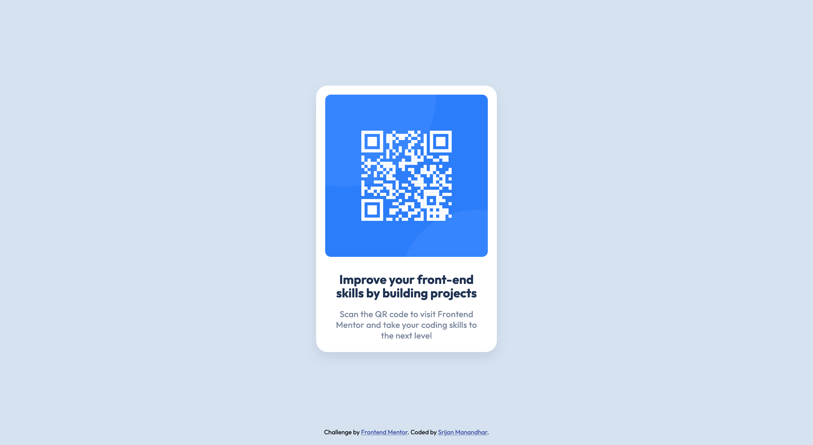

# Frontend Mentor - QR code component solution

This is a solution to the [QR code component challenge on Frontend Mentor](https://www.frontendmentor.io/challenges/qr-code-component-iux_sIO_H). Frontend Mentor challenges help you improve your coding skills by building realistic projects.

## Table of contents

- [Overview](#overview)
  - [Screenshot](#screenshot)
  - [Links](#links)
- [My process](#my-process)
  - [Built with](#built-with)
  - [What I learned](#what-i-learned)
  - [Continued development](#continued-development)
- [Author](#author)

## Overview

### Screenshot




### Links

- Solution URL: [https://github.com/srijanss/qr-code-component](https://github.com/srijanss/qr-code-component)
- Live Site URL: [https://srijanss.github.io/qr-code-component/](https://srijanss.github.io/qr-code-component/)

## My process

### Built with

- Semantic HTML5 markup
- CSS custom properties

### What I learned

```css
@import url("https://fonts.googleapis.com/css2?family=Outfit:wght@400;700&display=swap");

:root {
  --white-color: hsl(0, 0%, 100%);
  --light-gray-color: hsl(212, 45%, 89%);
  --grayish-blue-color: hsl(220, 15%, 55%);
  --shadow-color: hsla(220, 15%, 55%, 0.2);
  --dark-blue-color: hsl(218, 44%, 22%);
  --primary-font: "Outfit", sans-serif;
  --font-weight-regular: 400;
  --font-weight-bold: 700;
  --card-width: 320px;
  --card-height: 473px;
}
```

In our learning journey, we discovered the benefits of utilizing Google Fonts and CSS variables in our projects.

Google Fonts offers a wide range of fonts that can enhance the visual appeal of our websites. By linking to Google Fonts in our CSS files, we can easily access and apply these fonts to our text elements, adding diversity and style to our designs.

We explored the power of CSS variables in simplifying our stylesheets and improving maintainability. CSS variables allow us to define reusable values that can be used throughout our CSS files. This flexibility enables us to quickly make global style changes by adjusting just a few variable values, rather than modifying each individual occurrence. By leveraging CSS variables, we can create more consistent and adaptable designs, saving time and effort in the development process.

During development, we employed [live-server](https://www.npmjs.com/package/live-server) to streamline our workflow. This tool provides a simple way to set up a local development server that automatically refreshes the browser whenever changes are made to our project files. With live-server, we can instantly preview our changes without manually refreshing the page, enhancing our efficiency and productivity during the development process.

### Continued development

In our future projects, we are planning to use PostCSS and Vite to improve our development process. PostCSS is a tool that helps with CSS tasks such as adding prefixes and reducing file sizes. Vite is a modern tool that speeds up the building of our projects. By setting up Vite to work with PostCSS, we can make our CSS look better without spending extra time. This will result in faster and improved websites.

## Author

- Website - [Srijan Manandhar](ttps://github.com/srijanss)
- Frontend Mentor - [@srijanss](https://www.frontendmentor.io/profile/srijanss)
